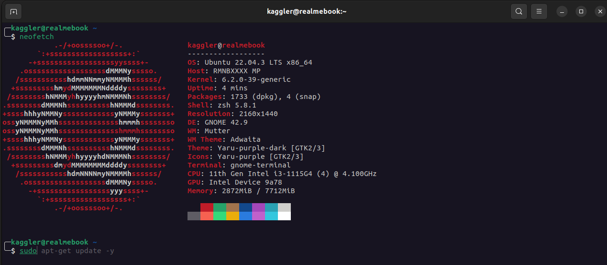

# Zsh Terminal Profile




This is my profile for UNIX(Linux) terminals.

#### `These commands were last tested on Jan 2024 on Ubuntu 22.04.`

### Update software repositories

```bash
sudo apt-get update && apt-get upgrade -y
```

# Installation

### Zsh, OhMyZsh

First, we have to install Zsh terminal and OhMyZsh.

```bash
./Terminal.sh
```

After this, the terminal should look a bit different, but we need to do the next step to have the
entire theme.

### Profile

The last command is to create a terminal profile that will set the colors and also set the font
to be the Powerline one we installed earlier (required for the theme to display correctly).

```bash
./Profile.sh
```

If it looks funky after this command, then you might need to wait until the theme is updated with a
Powerline font (the next step), and may need to also restart your machine.


### Display the profile

```bash
sudo apt-get install neofetch

neofetch
```